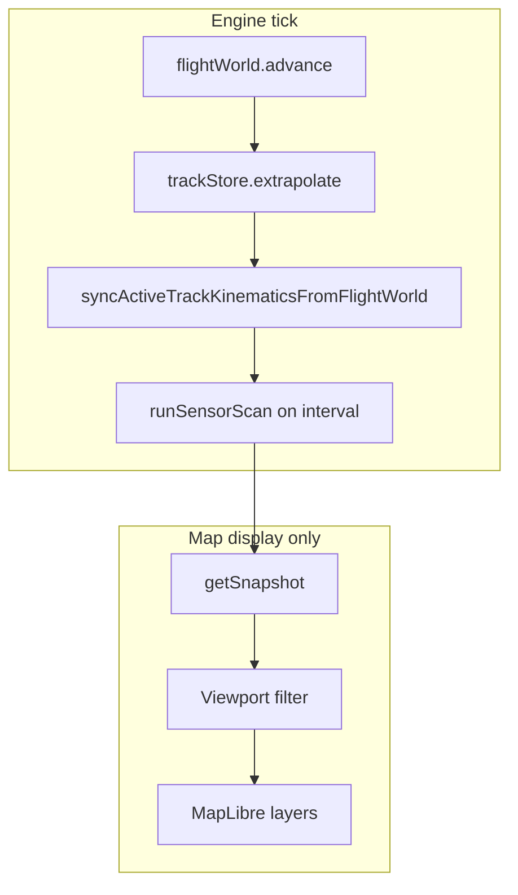

# [Airspace Simulator](https://github.com/danvanbueren/airspace-sim) &middot; [](https://github.com/danvanbueren/airspace-sim/blob/main/LICENSE.md) [](https://github.com/danvanbueren/airspace-sim) [](https://github.com/danvanbueren/airspace-sim/issues) [](https://github.com/danvanbueren/airspace-sim/commits/main/)

Airspace Simulator is a non-secure browser-based simulator for practicing command and control workflows in a simulated operational airspace. It is intended for learning, experimentation, and software development around airspace visualization, track management, grid references, map interaction patterns, and scenario-building tools.

This project is personal. It is not owned, operated, sponsored, or endorsed by any government entity. The repository is unclassified and should only contain unclassified, non-sensitive, non-operational information.

## Table of Contents

- [Get Started](#get-started)
  - [Developers](#developers)
  - [Testers](#testers)
- [Repository Structure](#repository-structure)
- [Tech Stack](#tech-stack)
- [Scripts](#scripts)
- [Application Architecture](#application-architecture)
  - [UI shell and providers](#ui-shell-and-providers)
  - [Map workspace](#map-workspace)
  - [Operator workflows](#operator-workflows)
  - [Settings and persistence](#settings-and-persistence)
- [Simulation Architecture](#simulation-architecture)
  - [Design goals](#design-goals)
  - [Module overview](#module-overview)
  - [Tick pipeline](#tick-pipeline)
  - [Per-sensor scan pipeline](#per-sensor-scan-pipeline)
  - [Flight world](#flight-world)
  - [Sensor simulation](#sensor-simulation)
  - [Correlation](#correlation)
  - [Track initiation (automatic)](#track-initiation-automatic)
  - [Track merge and deduplication](#track-merge-and-deduplication)
    - [Basics](#basics)
    - [When merge happens](#when-merge-happens)
    - [When merge never happens](#when-merge-never-happens)
    - [Survivor selection and merged properties](#survivor-selection-and-merged-properties)
    - [After merge](#after-merge)
  - [Manual tracks](#manual-tracks)
  - [Map display (Category Select Panel)](#map-display-category-select-panel)
  - [Settings reference (Simulation page)](#settings-reference-simulation-page)
  - [Development utilities](#development-utilities)
- [Roadmap](#roadmap)
- [Context](#context)
  - [Current Capabilities](#current-capabilities)
  - [Safety and Data Policy](#safety-and-data-policy)

## Get Started

### Developers

1. Fork the repository on GitHub: [danvanbueren/airspace-sim](https://github.com/danvanbueren/airspace-sim).
2. Clone your fork locally:

```bash
git clone https://github.com/<your-github-username>/airspace-sim.git
cd airspace-sim/airspace-sim
```

The Next.js application and `package.json` live in the nested `airspace-sim/` directory inside the repository root.

3. Install dependencies:

```bash
npm install
```

4. Start the development server:

```bash
npm run dev
```

5. Open the local app URL printed by Next.js, typically [http://localhost:3000](http://localhost:3000).

Before opening a pull request, make sure tests pass and the app still builds:

```bash
npm test
npm run build
```

### Testers

Testers can help by running the simulator locally, trying realistic workflows, and reporting confusing behavior, broken controls, visual issues, or crashes.

To run the app locally:

```bash
git clone https://github.com/danvanbueren/airspace-sim.git
cd airspace-sim/airspace-sim
npm install
npm run dev
```

Then open [http://localhost:3000](http://localhost:3000). Try creating tracks, editing callsigns and platform types in the Track Management window, dragging the map, switching settings, drawing bearing/range lines, changing keybinds, and refreshing the page to confirm persisted settings still behave as expected.

To test a production-style local deployment:

```bash
npm run build
npm run start
```

Report issues in [GitHub Issues](https://github.com/danvanbueren/airspace-sim/issues). Helpful reports include:

- What you expected to happen.
- What actually happened.
- Steps to reproduce the issue.
- Browser, operating system, and screen size.
- Screenshots or screen recordings when they clarify the problem.
- Any visible error messages from the app or browser console.

Do not include classified, sensitive, operational, export-controlled, or personally identifying information in issues, screenshots, sample scenarios, or pull requests.

## Repository Structure

```text
airspace-sim/
+-- app/
|   +-- components/
|   |   +-- global/          # Classification bars, commit display, markdown renderer, and global UI pieces.
|   |   +-- map/             # Map view, context menu, and cursor coordinate overlay.
|   |   +-- panels/          # Glass panels, settings toolbelt, settings modal pages.
|   |   +-- windows/         # Floating workflow windows such as track management.
|   +-- constants/           # Shared UI constants (for example, z-index layering).
|   +-- content/             # Markdown sources for in-app settings pages (for example, roadmap).
|   +-- contexts/            # React contexts for map state, theme, app settings, simulation.
|   +-- data/                # Curated airports and air routes (static JSON).
|   +-- hooks/
|   |   +-- global/          # Global interaction guards, measurement hooks, error forwarding.
|   |   +-- map/             # Map setup, controls, track/sensor/airport layers, bearing/range tools.
|   |   +-- simulation/      # Simulation tick loop (requestAnimationFrame).
|   +-- simulation/          # Track engine, flight world, sensor, initiation, correlation, merge.
|   +-- tools/
|   |   +-- browser/         # Browser storage helpers.
|   |   +-- external/        # External service helpers.
|   |   +-- formatting/      # Date/time, grid reference, callsign, and track field formatting.
|   |   +-- map/             # Map style paint helpers (for example, water and label theming).
|   |   +-- milstd2525/      # Symbol codes, familiar icons, and platform-specific type catalog.
|   +-- buildInfo.js         # Project metadata, links, version, and copyright text.
|   +-- globals.css          # Global styles.
|   +-- layout.js            # Root Next.js layout and providers.
|   +-- page.js              # Main simulator shell.
+-- public/
|   +-- map-styles/          # Local MapLibre style JSON files.
+-- tests/                   # Node test runner suites (formatting, simulation, milstd2525).
+-- AGENTS.md                # Workspace guidance for AI coding agents.
+-- CLAUDE.md                # Pointer to shared agent guidance.
+-- jsconfig.json            # JavaScript path alias configuration.
+-- next.config.mjs          # Next.js configuration.
+-- package-lock.json        # Locked dependency versions.
+-- package.json             # Project scripts and dependencies.
+-- README.md                # Short pointer to the root README.
```

Paths above are relative to the `airspace-sim/` application directory inside this repository.

## Tech Stack

- [Next.js](https://nextjs.org/) ([docs](https://nextjs.org/docs)) powers the application framework, development server, routing, build, and production start flow.
- [React](https://react.dev/) ([docs](https://react.dev/learn)) provides the component model, hooks, context providers, and client-side UI behavior.
- [Material UI](https://mui.com/material-ui/) ([docs](https://mui.com/material-ui/getting-started/)) provides the UI component library used for panels, buttons, forms, modals, typography, alerts, and layout.
- [Emotion](https://emotion.sh/docs/introduction) ([docs](https://emotion.sh/docs/introduction)) supports Material UI styling.
- [MapLibre GL JS](https://maplibre.org/projects/gl-js/) ([docs](https://maplibre.org/maplibre-gl-js/docs/)) renders the interactive map and map layers.
- [milsymbol](https://www.spatialillusions.com/) ([docs](https://github.com/spatialillusions/milsymbol)) generates full MIL-STD-2525-style tactical symbols when familiar icons or info fields are disabled.
- Custom familiar platform silhouettes (`createFamiliarTrackIcon.js`) provide simplified identity-colored icons for common air, surface, and subsurface tracks.
- [react-markdown](https://github.com/remarkjs/react-markdown) with [remark-gfm](https://github.com/remarkjs/remark-gfm) renders the in-app roadmap page from markdown.
- [mgrs](https://www.npmjs.com/package/mgrs) ([package docs](https://github.com/proj4js/mgrs)) converts coordinates into MGRS.
- [Fontsource Roboto](https://fontsource.org/fonts/roboto) ([docs](https://fontsource.org/docs/getting-started/introduction)) supplies the Roboto font used by Material UI.
- [npm](https://www.npmjs.com/) ([docs](https://docs.npmjs.com/)) manages dependencies and local scripts.

The current locked versions are defined in `package-lock.json`; use that file as the source of truth when checking exact dependency versions.

## Scripts

```bash
npm run dev
```

Starts the Next.js development server.

```bash
npm run build
```

Creates a production build.

```bash
npm run start
```

Starts the production server after a successful build.

```bash
npm test
```

Runs the Node test runner over `tests/formatting`, `tests/simulation`, and `tests/milstd2525`.

## Application Architecture

The simulator UI is a Next.js client application. Simulation state is produced in JavaScript modules under `app/simulation/` and consumed by MapLibre hooks under `app/hooks/map/`. The two sides meet in `MapView` and `SimulationContext`.

### UI shell and providers

[`app/layout.js`](airspace-sim/app/layout.js) wraps the app with providers (outermost to innermost):

| Provider | Role |
|----------|------|
| `MapStateProvider` | Registered map instance, alarm alerts, fixed-function zoom controls |
| `CustomThemeContext` | Light/dark theme (cookie-backed) |
| `AppSettingsProvider` | Grid reference system, simulation tuning (cookie-backed) |
| `ControlBindingsProvider` | Keyboard/mouse bindings (cookie-backed) |
| `SensorDisplayProvider` | Category Select Panel toggle state |
| `SimulationProvider` | Singleton `TrackEngine`, manual track APIs |

[`app/page.js`](airspace-sim/app/page.js) composes the main shell: classification bars, glass panels (Category Select, Fixed Function, alarm alerts, settings toolbelt), a dedicated map overlay layer for floating track windows, and the full-screen map.

### Map workspace

[`MapView`](airspace-sim/app/components/map/MapView.js) owns the MapLibre instance and wires:

- **Simulation loop** — [`useSimulationLoop`](airspace-sim/app/hooks/simulation/useSimulationLoop.js) calls `TrackEngine.tick()` on a throttled `requestAnimationFrame` schedule.
- **Track layer** — [`useTrackMapLayer`](airspace-sim/app/hooks/map/useTrackMapLayer.js) renders familiar platform silhouettes (default) or full MIL-STD-2525 symbols when info fields are enabled; draws callsign labels and heading/velocity vectors; only tracks inside the expanded viewport are drawn, with icon and vector size scaled by zoom.
- **Sensor layers** — [`useSensorDetectionMapLayer`](airspace-sim/app/hooks/map/useSensorDetectionMapLayer.js) renders radar/IFF tick marks; geometry is recomputed on pan/zoom so tick size stays proportional to zoom.
- **Overlays** — [`useAirportMapLayer`](airspace-sim/app/hooks/map/useAirportMapLayer.js) and [`useAirRouteMapLayer`](airspace-sim/app/hooks/map/useAirRouteMapLayer.js) for optional airport/route context.
- **Interactions** — Map pan/zoom, context menu (with inline grid-reference picker), bearing/range lines, track pick, draggable track management windows with keyboard custody and focus stacking, and map-click dismissal of transient windows.

Map styles are loaded from [`public/map-styles/`](airspace-sim/public/map-styles/) (Voyager for light mode, Dark Matter for dark mode). Water-feature and track label colors are adjusted at runtime for readability in each theme.

### Operator workflows

| Workflow | Entry point | Engine API |
|----------|-------------|------------|
| Initiate manual track | Map context menu → Initiate Track | `upsertManualTrack` |
| Edit track (including correlation mode) | Click symbol or context menu → Track Management window | `upsertManualTrack` (sets `userDirected`; converts auto tracks to manual) |
| Drop track | Context menu on existing track | `dropTrack` |
| Bearing/range | Context menu on map | Local map tool (not part of simulation engine) |
| Sensor/history visibility | Category Select Panel | Display toggles only (no sim logic) |
| Map zoom | Fixed Function Panel → Zoom In / Zoom Out | `MapStateProvider` zoom helpers (display only) |

The Track Management window edits callsign (alphanumeric, unique across tracks), domain, identity, MIL-STD type, platform-specific type (searchable catalog), optional symbol info fields, heading, speed, altitude, and correlation mode. While a window is open, displayed fields refresh from the live simulation about once per second; a field pauses live updates while it is focused for editing. Focusing a kinematic field without changing its value does not count as an operator commit. Invalid or duplicate callsigns are rejected in the UI and track store. Any committed edit from the window routes through `upsertManualTrack`, including correlation mode changes.

Manual track edits are marked `userDirected` so they take priority when tracks merge (see [Track merge and deduplication](#track-merge-and-deduplication)).

### Settings and persistence

Settings opened from the toolbelt modal are stored in the `appSettings` cookie via [`AppSettingsContext`](airspace-sim/app/contexts/AppSettingsContext.js). Simulation-related fields are passed to `TrackEngine` as `simulationSettings`. Keybinds and theme use separate cookies.

## Simulation Architecture

The in-app simulation is intentionally split into **four core systems** (flight world, sensor simulation, track initiation, correlation), plus **track merge/deduplication** and a thin orchestrator. Each module has a single responsibility; crossing those boundaries (for example, creating tracks inside the sensor layer) is avoided so behavior stays predictable and testable.

### Design goals

- **Stable world state** — Flights exist globally on realistic routes. Panning and zooming do not respawn aircraft in the viewport.
- **Sensor data is simulated, not authoritative** — Radar and IFF returns are noisy measurements derived from the flight world. They do not directly reveal ground-truth identities to track logic.
- **Tracks are operator artifacts** — Automatic tracks appear only after repeated sensor evidence. Correlation is a separate step that links returns to existing tracks.
- **Rendering is not simulation** — The map may hide off-screen tracks and scale icon and sensor tick size by zoom without changing what the engine stores.
- **Two distance knobs** — **Correlation threshold** (default 5 NM) controls which active track receives a return. **Plot association threshold** (default 3 NM) controls plot trails, initiation blocking near existing tracks, and the merge proximity check.

### Module overview

| Module | File(s) | Responsibility | Must not |
|--------|---------|----------------|----------|
| **Flight world** | `FlightWorldSimulator.js`, `flightWorldUtils.js`, `app/data/airports.json`, `app/data/airRoutes.json` | Persistent global aircraft on weighted city-pair routes; advance positions every tick | Emit sensor returns, create tracks, correlate |
| **Sensor simulation** | `SensorSimulator.js`, `sensorNoise.js` | Produce radar/IFF detections (with drop/noise) for aircraft inside the current scan bounds | Create or update tracks, correlate, delete aircraft by viewport |
| **Track initiation** | `TrackInitiationService.js`, `PlotAssociationStore.js` | Per-sensor plot trails; promote to a firm track after 3 associated hits | Mark detections correlated, use ground-truth IDs |
| **Correlation** | `CorrelationService.js`, `correlation.js` | Match detections to existing tracks (mode-aware nearest neighbor) | Create tracks, advance the flight world |
| **Track merge** | `trackMerge.js` | Collapse duplicate tracks that compete for the same sensor return; merge metadata with user-priority rules | Run sensor scans, create plots |
| **Orchestrator** | `TrackEngine.js` | Fixed tick order, settings, sensor history buffers, snapshots | Inline business logic from the modules above |

Supporting pieces include `TrackStore.js` (firm track state, callsign validation, extrapolation, and merge), `PerfBudgetController.js` (slows update rate under load without trimming the global fleet), `mapViewportUtils.js` (shared zoom scale and viewport bounds filtering for display), `trackVectorFeatures.js` (heading/velocity vector geometry for MapLibre), `HistoryPlaybackController.js` (sensor history playback stepping), `detectionFeatures.js` (sensor tick geometry for MapLibre), and `SensorFeedAdapter.js` / `RemoteFeedAdapter.js` (stubs for future external sensor feeds).

### Tick pipeline

On each simulation step, `TrackEngine.tick()` runs this sequence:

1. **`flightWorld.advance(delta)`** — Move all active flights along their route polylines (great-circle segments). On route completion, assign a new weighted route; aircraft IDs stay stable (`FLT-{n}`).
2. **`trackStore.extrapolate(delta)`** — Advance firm track positions according to each track’s correlation mode.
3. **`syncActiveTrackKinematicsFromFlightWorld()`** — Refresh active track heading, speed, and altitude from the nearest truth aircraft each tick, except fields the operator committed in the Track Management window.
4. **Sensor scans (on interval)** — When radar or IFF refresh elapses, run the [per-sensor scan pipeline](#per-sensor-scan-pipeline) below.
5. **`getSnapshot()`** — Expose tracks, sensor cycles, airports/routes, and overlay visibility to the map hooks.

World motion and track extrapolation run every tick when the simulation engine is enabled. Sensor processing runs at radar/IFF refresh rates, not necessarily every tick. Disabling **Enable simulation engine** in Settings → Simulation pauses flight-world motion, extrapolation, and sensor scans while leaving existing tracks on the map.



### Per-sensor scan pipeline

Each call to `TrackEngine.runSensorScan()` (radar or IFF) follows this order. Correlation always runs **before** initiation so existing active tracks can claim returns first.

1. **`sensorSimulator.scan`** — Raw detections for aircraft inside expanded map bounds.
2. **`correlation.apply`** — Nearest available **active** track within **Correlation threshold (NM)** (default 5 NM) receives the return; a track can claim at most one return per scan, and position updates from sensor.
3. **`mergeTracksFromCorrelatedDetections`** — Active tracks that lost correlation to a nearby winner on the same identity merge into the survivor (see [Track merge](#track-merge-and-deduplication)).
4. **`absorbPlotsNearCorrelatedDetections`** — Plot trails near correlated returns are closed so parallel radar/IFF plots do not spawn duplicate tracks.
5. **`trackInitiation.ingest` (uncorrelated only)** — Update plots and promote after 3 hits; skip returns near existing active tracks within the plot association threshold.
6. **History buffer** — Store annotated detections for current/history display.

### Flight world

- **Data** — `app/data/airports.json` (major airports and regional strips) and `app/data/airRoutes.json` (origin/destination pairs with traffic `weight`).
- **Fleet size** — Controlled by **Max active flights (global)** in Settings → Simulation (`maxActiveFlights`). Quality presets cap the target count (`low` 400, `balanced` 800, `high` 1200, `global_dense` 1500). Under adaptive performance, the engine may **lower tick rate** but does **not** delete flights to match the viewport.
- **Traffic distribution** — New flights pick routes by weight, not by where the map is centered, so empty regions do not accumulate spurious traffic.

### Sensor simulation

- **Scan intervals** — Configurable radar and IFF refresh intervals (defaults 4 s and 1 s).
- **Detections** — Each return includes position, sensor type, timestamp, and quality. Public detections do **not** carry a ground-truth `truthId`; initiation and correlation work from geometry and time only.
- **Noise** — Per-sensor drop probability and position error (`sensorNoise.js`), seeded from aircraft id and scan time for repeatable behavior.
- **Display** — Tick marks use screen-space length scaled by the same zoom curve as track icons (`getTrackIconScaleForZoom` in `mapViewportUtils.js`), so returns stay small when zoomed out. Line stroke width also scales down at low zoom.

### Correlation

- Runs **before** automatic initiation on every sensor scan.
- Only tracks with **`correlationMode: 'active'`** are correlation targets.
- Nearest available track within **Correlation threshold (NM)** wins (default 5 NM), with one-to-one assignment so a single track cannot consume multiple returns from the same scan.
- Matched detections are marked `correlated: true` and update the track position from the sensor return.
- Returns already correlated are not passed to initiation.

**Track correlation modes** (editable in the Track Management window):

| Mode | Behavior |
|------|----------|
| `active` | Default. Correlates to nearby sensor returns; sensor updates position. |
| `extrapolated` | Ignores sensor correlation; position advances by extrapolation only. |
| `suspend` | Speed forced to 0; no correlation; holds position. |

Manual tracks default to `active`. Opening an auto track in the Track Management window and committing any edit converts it to a manual track via `upsertManualTrack`.

### Track initiation (automatic)

- **Separate plot stores** for radar and IFF (independent 3-hit trails per sensor).
- Each scan, **uncorrelated** returns associate to the nearest plot within **Plot association threshold (NM)** (default 3 NM).
- Returns within that distance of an **active** track are ignored for plot counting, so existing tracks can claim contacts before new plots form.
- After **3** consistent hits on the same plot (`TRACK_INITIATION_HIT_COUNT`), a firm track is created with `source: 'auto'` and `initiatedBy` set to the sensor type, unless an active track is already within the plot association threshold.
- New auto tracks start **uncorrelated**; the next scan’s correlation step links sensor returns and sets `correlated: true` when successful.
- **Dropping a track** removes it from the track store only; sensor plots and returns continue. The same contact can initiate again after another 3-hit trail (merged-away auto track IDs are blocked from immediate re-add).

### Track merge and deduplication

Track merge is a **separate step from correlation**. Correlation links sensor returns to existing tracks; merge removes **duplicate tracks** that are fighting over the **same** return. It is implemented in [`trackMerge.js`](airspace-sim/app/simulation/trackMerge.js) as `mergeTracksFromCorrelatedDetections`, called once per radar or IFF scan after correlation completes.

#### Basics

**Problem it solves:** The same aircraft can end up with more than one firm track — for example separate radar and IFF auto-initiations, or a manual track placed near an auto track on the same contact. Without merge, those duplicates stack on the scope.

**What it does:** When one track **wins** correlation to a sensor return and another nearby track **loses** (same identity, both in **Active** correlation mode), the loser is combined into a single survivor track.

**What it does not do:** Merge is **not** a general “combine everything within 3 NM” rule. Two fighters in formation each correlating to their **own** return stay as two tracks. Tracks in **Extrapolated** or **Suspended** mode never participate in merge.

**Who can merge:** Manual and auto tracks use the same rules. The only hard block on merge is a **different identity** (for example Friendly vs Hostile).

#### When merge happens

After each sensor scan:

1. Correlation assigns each return to at most one **Active** track within the correlation threshold (default 5 NM).
2. Merge looks for **Active** tracks that are within the plot association threshold (default 3 NM) of a return correlated to a **different** track, share the same identity, and did **not** correlate on that scan.
3. The loser merges into the survivor.

**Example — duplicate on one contact:** Track A (radar-initiated) and Track B (IFF-initiated) sit on the same aircraft. On the next radar scan, the return correlates to A. B is nearby, same identity, Active, but did not correlate → B merges into A.

**Example — formation stays separate:** Track A and Track B are two Neutrals flying in formation. Each correlates to its own return on the same scan → neither is eligible to merge into the other.

#### When merge never happens

- Either track is in **Extrapolated** or **Suspended** correlation mode (only **Active** tracks merge).
- Tracks have **different identities**.
- Both tracks correlated to their own returns on the same scan (typical formation case).
- Tracks are far apart — merge only considers candidates within the plot association threshold of the **winning** correlated return.

#### Survivor selection and merged properties

**Survivor priority** (which track ID remains):

1. Manual track
2. Operator-edited track (`userDirected`)
3. Track with the most recent sensor update

**What carries over to the survivor:**

| Field | Rule |
|-------|------|
| Callsign, type | Most recent value; operator edits (non-auto-generated callsigns) win on conflict |
| Domain, identity, specific type, info fields, correlation mode, symbol options | Operator-edited values win; otherwise survivor keeps its existing value |
| Heading, speed, altitude | From the **correlated** track’s sensor-driven kinematics (not averaged or copied from the loser) |
| Position | From the correlated track when it has the newer sensor update |

Operator edits in the Track Management window set `userDirected` and `lastUserEditAt`, which take priority when symbol metadata conflicts. Auto-generated callsigns (`CIV##`, `TRK-*`, `FLT-*`) do not count as operator callsign edits during merge.

#### After merge

The non-survivor track is deleted. Auto track IDs that were merged away are remembered so initiation does not immediately recreate the same symbol on the next scan.

### Manual tracks

- **Initiate Track** (map context menu) creates a manual track via `upsertManualTrack`.
- Manual updates go through the same track store and set `userDirected` so merges respect operator intent.
- Callsigns must be alphanumeric and unique; invalid entries fall back to the next available `CIV##` callsign (`callsignValidation.js`).
- Editing an auto track in the Track Management window converts it to a manual track.
- **Drop Track** calls `dropTrack` for both manual and automatic tracks.

### Map display (Category Select Panel)

Sensor and overlay visibility are display-only toggles:

| Toggle | Layer |
|--------|--------|
| `IFF_CURRENT` / `IFF_HISTORY` | IFF sensor lines (current scan / history playback) |
| `RADAR_CURRENT` / `RADAR_HISTORY` | Radar sensor lines |
| `AIRPORTS` | Airport and airstrip points |
| `AIR_ROUTES` | Common route polylines |

**Sensor line symbology**

- **Uncorrelated** — Short horizontal line (amber radar, green IFF).
- **Correlated** — Short vertical line (same colors).
- Tick length and stroke width scale with map zoom (aligned with track icon scaling).

**Track symbols**

- Familiar platform silhouettes (identity-colored, type-aware) render by default; enabling **Show symbol info fields** switches to full MIL-STD-2525 icons via milsymbol.
- Platform-specific type options come from the curated catalog under `app/tools/milstd2525/trackPlatformCatalog/`.
- Callsign labels and heading/velocity vectors render alongside each firm track; vector length scales with speed and zoom.
- Icon, label, and vector size scale with map zoom via MapLibre interpolation (smaller when zoomed out).
- Only tracks inside the expanded viewport are sent to the map layer; the engine snapshot still holds all firm tracks globally.

### Settings reference (Simulation page)

| Setting | Role |
|---------|------|
| Enable simulation engine | Pauses or resumes flight-world motion, extrapolation, and sensor scans |
| Radar / IFF refresh (ms) | Sensor scan cadence |
| Track update rate (Hz) | Simulation tick rate (may be reduced by adaptive performance) |
| Correlation threshold (NM) | Max distance to link a return to an active track |
| Plot association threshold (NM) | Plot trail association, initiation blocking near active tracks, and merge proximity to a correlated return (default 3 NM) |
| Max active flights (global) | Target fleet size |
| Quality preset | Applies preset Hz and fleet caps |
| Adaptive performance balancing | Reduces tick rate under frame pressure; does not cull the fleet by viewport |

### Development utilities

In development builds, the stress harness is exposed on `window.__airspaceSimStressHarness` (see `app/simulation/stressHarness.js`) for timing benchmarks.

## Roadmap

Near-term and exploratory work includes:

- Reference point creation and management.
- Pre-built training scenarios and recurring tactical picture templates.
- End-to-end control loops for mission practice.
- Automated picture call calculations inspired by ParrotSour workflows.
- Additional fuel, weapons, timeline, and mission-planning concepts represented with unclassified simulated data only.

The in-app **Settings → Roadmap** page (`app/content/settings-roadmap.md`) is the live checklist with completed items and commit links.

## Context

Airspace Simulator is a spiritual successor to John McCarthy's [ParrotSour](https://parrotsour.com/), with a focus on making command and control practice more approachable in a modern web application. The long-term goal is to provide a training sandbox where aircrew, operators, controllers, students, and hobbyist developers can rehearse airspace management concepts without relying on classified systems or operational data.

The mission is to build a practical, extensible, and transparent simulator that can support:

- Interactive map familiarization and airspace visualization.
- Track creation, labeling, and management workflows.
- Bearing/range measurement and map annotation tools.
- Multiple grid reference formats used in operational discussions.
- Scenario construction for repeatable training events.
- Sensor, radar, IFF, and track automation experiments using simulated data only (see [Simulation Architecture](#simulation-architecture)).

### Current Capabilities

- Full-screen map workspace with light and dark map styles and theme-aware water/label paint.
- Glass panels for category select, fixed-function controls (zoom in/out), alarm alerts, and settings.
- **Global flight simulation** on weighted air routes between curated airports (no viewport-random spawning); can be paused via **Enable simulation engine**.
- **Separated sensor, initiation, and correlation pipeline** (see [Simulation Architecture](#simulation-architecture)).
- Simulated **radar and IFF** returns with history playback and Category Select Panel toggles.
- **Track merge** after correlation — collapses duplicate tracks competing for the same sensor return; formation pairs correlating separately are left alone ([details](#track-merge-and-deduplication)).
- **Automatic track initiation** after three per-sensor plot updates on uncorrelated returns only.
- Manual track initiation and editing from the map context menu, with correlation mode (active / extrapolated / suspend); editing an auto track converts it to manual.
- Track Management window with domain, identity, MIL-STD type, searchable platform-specific type, callsign validation, and optional symbol info fields.
- Familiar platform silhouettes with MIL-STD-2525 fallback, callsign labels, and speed-scaled heading vectors on the map.
- Optional **airport** and **air route** overlay layers.
- Bearing/range drawing, context menus, and line removal controls.
- Cursor coordinate overlay with selectable grid reference systems.
- Supported coordinate displays include DD, DDM, DMS, GARS, Geohash, GEOREF, Killbox-style GARS, and MGRS.
- Configurable keyboard and mouse controls persisted in browser cookies.
- In-app settings, keybinds, about, and markdown-backed roadmap pages.
- Node test suites for formatting, simulation, and symbol helpers (`npm test`).
- Error forwarding into an in-app alert panel for easier testing feedback.

### Safety and Data Policy

Use simulated data only. Do not commit, upload, paste, screenshot, or describe classified, controlled, sensitive, operational, or real-world mission data. When in doubt, leave it out and use fictional examples.
