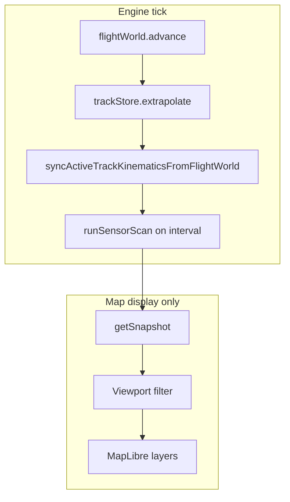

# Simulation Architecture

**Last updated:** June 2026  
**Audience:** Contributors working on the track engine, sensor pipeline, and simulation modules.

The in-app simulation is intentionally split into **four core systems** (flight world, sensor simulation, track initiation, correlation), plus **track merge/deduplication** and a thin orchestrator. Each module has a single responsibility; crossing those boundaries (for example, creating tracks inside the sensor layer) is avoided so behavior stays predictable and testable.

See the [repository root README](../../README.md) for setup and a high-level overview. For UI integration, see [Application Architecture](application-architecture.md).

Module paths below are under `airspace-sim/app/simulation/` unless noted.

## Design goals

- **Stable world state** — Flights exist globally on realistic routes. Panning and zooming do not respawn aircraft in the viewport.
- **Sensor data is simulated, not authoritative** — Radar and IFF returns are noisy measurements derived from the flight world. They do not directly reveal ground-truth identities to track logic.
- **Tracks are operator artifacts** — Automatic tracks appear only after repeated sensor evidence. Correlation is a separate step that links returns to existing tracks.
- **Rendering is not simulation** — The map may hide off-screen tracks and scale icon and sensor tick size by zoom without changing what the engine stores.
- **Two distance knobs** — **Correlation threshold** (default 5 NM) controls which active track receives a return. **Plot association threshold** (default 3 NM) controls plot trails, initiation blocking near existing tracks, and the merge proximity check.

## Module overview

| Module | File(s) | Responsibility | Must not |
|--------|---------|----------------|----------|
| **Flight world** | `FlightWorldSimulator.js`, `flightWorldUtils.js`, `app/data/airports.json`, `app/data/airRoutes.json` | Persistent global aircraft on weighted city-pair routes; advance positions every tick | Emit sensor returns, create tracks, correlate |
| **Sensor simulation** | `SensorSimulator.js`, `sensorNoise.js` | Produce radar/IFF detections (with drop/noise) for aircraft inside the current scan bounds | Create or update tracks, correlate, delete aircraft by viewport |
| **Track initiation** | `TrackInitiationService.js`, `PlotAssociationStore.js` | Per-sensor plot trails; promote to a firm track after 3 associated hits | Mark detections correlated, use ground-truth IDs |
| **Correlation** | `CorrelationService.js`, `correlation.js` | Match detections to existing tracks (mode-aware nearest neighbor) | Create tracks, advance the flight world |
| **Track merge** | `trackMerge.js` | Collapse duplicate tracks that compete for the same sensor return; merge metadata with user-priority rules | Run sensor scans, create plots |
| **Orchestrator** | `TrackEngine.js` | Fixed tick order, settings, sensor history buffers, snapshots | Inline business logic from the modules above |

Supporting pieces include `TrackStore.js` (firm track state, callsign validation, extrapolation, and merge), `PerfBudgetController.js` (slows update rate under load without trimming the global fleet), `mapViewportUtils.js` (shared zoom scale and viewport bounds filtering for display), `trackVectorFeatures.js` (heading/velocity vector geometry for MapLibre), `HistoryPlaybackController.js` (sensor history playback stepping), `detectionFeatures.js` (sensor tick geometry for MapLibre), and `SensorFeedAdapter.js` / `RemoteFeedAdapter.js` (stubs for future external sensor feeds).

## Tick pipeline

On each simulation step, `TrackEngine.tick()` runs this sequence:

1. **`flightWorld.advance(delta)`** — Move all active flights along their route polylines (great-circle segments). Each aircraft climbs after departure at reduced speed, cruises with altitude-dependent speed plus continuous heading/speed jitter, and descends before arrival. On route completion, assign a new weighted route; aircraft IDs stay stable (`FLT-{n}`).
2. **`trackStore.extrapolate(delta)`** — Advance firm track positions according to each track’s correlation mode. Expired operator kinematic holds are cleared here.
3. **`syncActiveTrackKinematicsFromFlightWorld()`** — Refresh active track heading, speed, and altitude from the nearest truth aircraft each tick, except while an operator kinematic hold is active or a field was committed in the Track Management window.
4. **Sensor scans (on interval)** — When radar or IFF refresh elapses, run the [per-sensor scan pipeline](#per-sensor-scan-pipeline) below.
5. **`getSnapshot()`** — Expose tracks, sensor cycles, airports/routes, and overlay visibility to the map hooks.

World motion and track extrapolation run every tick when the simulation engine is enabled. Sensor processing runs at radar/IFF refresh rates, not necessarily every tick. Disabling **Enable simulation engine** in Settings → Simulation Engine pauses flight-world motion, extrapolation, and sensor scans while leaving existing tracks on the map.

## Per-sensor scan pipeline

Each call to `TrackEngine.runSensorScan()` (radar or IFF) follows this order. Correlation always runs **before** initiation so existing active tracks can claim returns first.

1. **`sensorSimulator.scan`** — Raw detections for aircraft inside expanded map bounds.
2. **`correlation.apply`** — Nearest available **active** track within **Correlation threshold (NM)** (default 5 NM) receives the return; a track can claim at most one return per scan, and position updates from sensor.
3. **`mergeTracksFromCorrelatedDetections`** — Active tracks that lost correlation to a nearby winner on the same identity merge into the survivor (see [Track merge](#track-merge-and-deduplication)).
4. **`absorbPlotsNearCorrelatedDetections`** — Plot trails near correlated returns are closed so parallel radar/IFF plots do not spawn duplicate tracks.
5. **`trackInitiation.ingest` (uncorrelated only)** — Update plots and promote after 3 hits; skip returns near existing active tracks within the plot association threshold.
6. **History buffer** — Store annotated detections for current/history display.

## Flight world

- **Data** — `../../airspace-sim/app/data/airports.json` (major airports and regional strips) and `../../airspace-sim/app/data/airRoutes.json` (origin/destination pairs with traffic `weight`).
- **Fleet size** — Controlled by **Max active flights (global)** in Settings → Simulation Engine (`maxActiveFlights`). Quality presets cap the target count (`low` 400, `balanced` 800, `high` 1000, `global_dense` / Ultra 1500). Under adaptive performance, the engine may **lower tick rate** but does **not** delete flights to match the viewport.
- **Traffic distribution** — New flights pick routes by weight, not by where the map is centered, so empty regions do not accumulate spurious traffic.
- **General aviation** — A small slice of the fleet (~4%, capped at 40) flies slow, low-altitude local orbits near airports (`generalAviationTraffic.js`). GA aircraft squawk VFR Mode 3 codes (`1200` in North America, `7000` elsewhere).

## Sensor simulation

- **Scan intervals** — Configurable radar and IFF refresh intervals (defaults 4 s and 1 s).
- **Detections** — Each return includes position, sensor type, timestamp, and quality. Radar returns are position-only. **IFF returns also carry a Mode 3/A squawk code** (`mode3Code`) derived from the truth aircraft transponder setting. Codes are stored on sensor history for future search but are **not** rendered on the map.
- **Mode 3 assignment** — Commercial and military traffic receive discrete octal codes. The fleet maintains **1–3 active emergency squawks** (`7500`, `7600`, or `7700`) at any time via `maintainFleetEmergencySquawks` in `iffMode3.js`.
- **Noise** — Per-sensor drop probability and position error (`sensorNoise.js`), seeded from aircraft id and scan time for repeatable behavior.
- **Display** — Tick marks use screen-space length scaled by the same zoom curve as track icons (`getTrackIconScaleForZoom` in `mapViewportUtils.js`), so returns stay small when zoomed out. Line stroke width also scales down at low zoom.

## Correlation

- Runs **before** automatic initiation on every sensor scan.
- Only tracks with **`correlationMode: 'active'`** are correlation targets.
- Nearest available track within **Correlation threshold (NM)** wins (default 5 NM), with one-to-one assignment so a single track cannot consume multiple returns from the same scan.
- **IFF code preference** — Tracks that already hold a correlated IFF Mode 3 code re-bind to returns carrying that same code before generic nearest-neighbor matching runs (`iffCorrelation.js`).
- **IFF separation** — When no IFF return with the track's stored code is within the correlation threshold, the code is cleared from the track.
- Matched detections are marked `correlated: true` and update the track position from the sensor return. IFF correlations also update read-only track fields `iffMode3Code` and `iffMode3UpdatedAt`.
- Returns already correlated are not passed to initiation.

**Track correlation modes** (editable in the Track Management window):

| Mode | Behavior |
|------|----------|
| `active` | Default. Correlates to nearby sensor returns; sensor updates position. |
| `extrapolated` | Ignores sensor correlation; position advances by extrapolation only. |
| `suspend` | Speed forced to 0; no correlation; holds position. |

Manual tracks default to `active`. Opening an auto track in the Track Management window and committing any edit converts it to a manual track via `upsertManualTrack`.

## Track initiation (automatic)

- **Separate plot stores** for radar and IFF (independent 3-hit trails per sensor).
- Each scan, **uncorrelated** returns associate to the nearest plot within **Plot association threshold (NM)** (default 3 NM).
- Returns within that distance of an **active** track are ignored for plot counting, so existing tracks can claim contacts before new plots form.
- After **3** consistent hits on the same plot (`TRACK_INITIATION_HIT_COUNT`), a firm track is created with `source: 'auto'` and `initiatedBy` set to the sensor type, unless an active track is already within the plot association threshold.
- New auto tracks start **uncorrelated**; the next scan’s correlation step links sensor returns and sets `correlated: true` when successful.
- **Dropping a track** removes it from the track store only; sensor plots and returns continue. The same contact can initiate again after another 3-hit trail (merged-away auto track IDs are blocked from immediate re-add).

## Track merge and deduplication

Track merge is a **separate step from correlation**. Correlation links sensor returns to existing tracks; merge removes **duplicate tracks** that are fighting over the **same** return. It is implemented in [`trackMerge.js`](../../airspace-sim/app/simulation/trackMerge.js) as `mergeTracksFromCorrelatedDetections`, called once per radar or IFF scan after correlation completes.

## Basics

**Problem it solves:** The same aircraft can end up with more than one firm track — for example separate radar and IFF auto-initiations, or a manual track placed near an auto track on the same contact. Without merge, those duplicates stack on the scope.

**What it does:** When one track **wins** correlation to a sensor return and another nearby track **loses** (same identity, both in **Active** correlation mode), the loser is combined into a single survivor track.

**What it does not do:** Merge is **not** a general “combine everything within 3 NM” rule. Two fighters in formation each correlating to their **own** return stay as two tracks. Tracks in **Extrapolated** or **Suspended** mode never participate in merge.

**Who can merge:** Manual and auto tracks use the same rules. The only hard block on merge is a **different identity** (for example Friendly vs Hostile).

## When merge happens

After each sensor scan:

1. Correlation assigns each return to at most one **Active** track within the correlation threshold (default 5 NM).
2. Merge looks for **Active** tracks that are within the plot association threshold (default 3 NM) of a return correlated to a **different** track, share the same identity, and did **not** correlate on that scan.
3. The loser merges into the survivor.

**Example — duplicate on one contact:** Track A (radar-initiated) and Track B (IFF-initiated) sit on the same aircraft. On the next radar scan, the return correlates to A. B is nearby, same identity, Active, but did not correlate → B merges into A.

**Example — formation stays separate:** Track A and Track B are two Neutrals flying in formation. Each correlates to its own return on the same scan → neither is eligible to merge into the other.

## When merge never happens

- Either track is in **Extrapolated** or **Suspended** correlation mode (only **Active** tracks merge).
- Tracks have **different identities**.
- Both tracks correlated to their own returns on the same scan (typical formation case).
- Tracks are far apart — merge only considers candidates within the plot association threshold of the **winning** correlated return.

## Survivor selection and merged properties

**Survivor priority** (which track ID remains):

1. Manual track
2. Operator-edited track (`userDirected`)
3. Track with the most recent sensor update

**What carries over to the survivor:**

| Field | Rule |
|-------|------|
| Callsign, type | Most recent value; operator edits (non-auto-generated callsigns) win on conflict |
| Domain, identity, specific type, info fields, correlation mode, symbol options | Operator-edited values win; otherwise survivor keeps its existing value |
| Heading, speed, altitude | From the **correlated** track’s sensor-driven kinematics (not averaged or copied from the loser) |
| Position | From the correlated track when it has the newer sensor update |

Operator edits in the Track Management window set `userDirected` and `lastUserEditAt`, which take priority when symbol metadata conflicts. Auto-generated callsigns (`CIV##`, `TRK-*`, `FLT-*`) do not count as operator callsign edits during merge.

## After merge

The non-survivor track is deleted. Auto track IDs that were merged away are remembered so initiation does not immediately recreate the same symbol on the next scan.

## Manual tracks

- **Initiate Track** (map context menu) creates a manual track via `upsertManualTrack`.
- Manual updates go through the same track store and set `userDirected` so merges respect operator intent.
- Callsigns must be alphanumeric and unique; invalid entries fall back to the next available `CIV##` callsign (`callsignValidation.js`).
- Editing an auto track in the Track Management window converts it to a manual track.
- **Drop Track** calls `dropTrack` for both manual and automatic tracks.

## Map display (Category Select Panel)

Sensor and overlay visibility are display-only toggles:

| Toggle | Layer |
|--------|--------|
| `IFF_CURRENT` / `IFF_HISTORY` | IFF sensor lines (current scan / history playback) |
| `RADAR_CURRENT` / `RADAR_HISTORY` | Radar sensor lines |
| `AIRPORTS` | Airport and airstrip points |
| `AIR_ROUTES` | Common route polylines |

**Sensor line symbology**

- **Uncorrelated** — Short horizontal line (amber radar, green IFF).
- **Correlated** — Short vertical line (same colors).
- Tick length and stroke width scale with map zoom (aligned with track icon scaling).

**Track symbols**

- Familiar platform silhouettes (identity-colored, type-aware) render by default; enabling **Show symbol info fields** switches to full MIL-STD-2525 icons via milsymbol.
- Platform-specific type options come from the curated catalog under [`trackPlatformCatalog/`](../../airspace-sim/app/tools/milstd2525/trackPlatformCatalog/).
- Callsign labels and heading/velocity vectors render alongside each firm track; vector length scales with speed and zoom.
- Icon, label, and vector size scale with map zoom via MapLibre interpolation (smaller when zoomed out).
- Only tracks inside the expanded viewport are sent to the map layer; the engine snapshot still holds all firm tracks globally.

## Settings reference

## Simulation Engine

| Setting | Role |
|---------|------|
| Enable simulation engine | Pauses or resumes flight-world motion, extrapolation, and sensor scans |
| Radar / IFF refresh (ms) | Sensor scan cadence |
| Correlation threshold (NM) | Max distance to link a return to an active track |
| Plot association threshold (NM) | Plot trail association, initiation blocking near active tracks, and merge proximity to a correlated return (default 3 NM) |
| Track update rate (Hz) | Simulation tick rate (may be reduced by adaptive performance) |
| Max active flights (global) | Target fleet size |
| Quality preset | Applies preset Hz and fleet caps |
| Adaptive performance balancing | Reduces tick rate under frame pressure; does not cull the fleet by viewport |
| Viewport-based track dropping | When enabled, limits sensor scans to the visible map area so off-viewport tracks may go stale and auto-drop; when disabled, scans the full global fleet to maintain all firm tracks |

## Look & Feel

| Setting | Role |
|---------|------|
| Color mode | Light or dark map basemap and application theme |
| Grid reference display format | Coordinate format for the cursor tooltip and context menu |
| Bearing/range line persistence | Default commit behavior: temporary by default, permanent by default (inverted), always permanent, or never permanent |
| Keyboard pan speed | Base WASD pan rate in pixels per second |
| Keyboard pan speed modifier | Multiplier applied while holding the speed modifier key |

## Advanced

| Setting | Role |
|---------|------|
| Context menu and bearing/range sensitivity | Timeout, movement limit, and minimum line length for map interactions |
| Show performance analytics overlay | Live half-opacity map overlay with stacked frame-time history (1 s intervals, ~15 s window) broken down by pipeline stage |

## Development utilities

In development builds, the stress harness is exposed on `window.__airspaceSimStressHarness` (see [`stressHarness.js`](../../airspace-sim/app/simulation/stressHarness.js)) for timing benchmarks. The **Show performance analytics overlay** toggle in Settings → Advanced is on by default; disable it to hide the live FPS, track counts, and stacked frame-time chart on the map.
