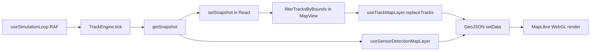

# Performance analysis

Analysis of simulator rendering and simulation cost, conducted June 2026. Goal: understand why the app can stress high-end hardware and identify a path to **60 fps on a basic laptop** with hundreds of visible tracks.

## Executive summary

The app is slow because of **compounding costs**, not because it draws thousands of DOM sprites. Aircraft are already rendered by **MapLibre WebGL symbol layers**. The main pain points are:

1. **React re-renders on every simulation tick** (~10 Hz)
2. **Full GeoJSON `setData` rebuilds** across six sources, repeated on pan/zoom
3. **O(n²) sensor correlation** during radar/IFF scans
4. **Global fleet simulation** (up to 1500 aircraft) independent of viewport
5. **Globe projection + dense vector basemap** (93 layers) consuming GPU budget
6. **`icon-allow-overlap: true`** forcing MapLibre to draw every symbol without collision culling

Pure JavaScript render-prep (building GeoJSON, `map.project`) is relatively cheap on a fast CPU. **MapLibre's reaction to `setData()`** and **React reconciliation** dominate browser time.

---

## Architecture

### Tech stack (rendering)

| Layer | Technology |
|-------|------------|
| Framework | Next.js 16, React 19 |
| Map | MapLibre GL JS 5.x (internal WebGL) |
| Tracks | GeoJSON sources + symbol/line layers |
| Icons | Canvas 2D → `ImageBitmap` → `map.addImage` (image atlas) |
| Overlays | HTML/React for attention labels, bearing/range markers |

There is **no custom WebGL** for tracks today. Canvas is used only to rasterize MIL-STD-2525 / familiar silhouettes before upload to MapLibre.

### Data flow

**Key separation:** the engine holds **all firm tracks globally**. Viewport culling is **display-only** (`MapView.js` → `filterTracksByBounds`).

### Per-tick work (~10 Hz)

1. `TrackEngine.tick()` — flight world advance, extrapolation, sensor scans
2. `notifyListeners()` → `setSnapshot()` → **MapView subtree re-render**
3. `replaceTracks(visibleTracks)` — full track map replace
4. `scheduleSetData()` — 2× `setData` (symbols + heading vectors)
5. `useSensorDetectionMapLayer` — 4× `setData` (radar/IFF current/history)

### Per pan/zoom frame (up to 60 Hz while dragging)

1. `MapView` `move`/`zoom` → `replaceTracks` again
2. `useTrackMapLayer` → `scheduleSetData` (vectors use screen-space `project`/`unproject` per track)
3. `useSensorDetectionMapLayer` → 4× `setData` with reprojected tick geometry
4. `TrackAttentionOverlay` → `setState` + `map.project()` per flagged track

---

## How aircraft are drawn

1. Simulation produces track objects (lng/lat, heading, identity, type, …)
2. `MapView` filters to viewport-visible tracks → `trackMapLayer.replaceTracks`
3. `trackToFeature` builds GeoJSON Points with `properties.icon` = cached icon ID
4. `ensureTrackIcon` (async) rasterizes familiar silhouette or full milsymbol → `map.addImage`
5. MapLibre **symbol layer** `tracks-symbols` draws icons with zoom-based size and map-aligned rotation
6. Separate **symbol layer** for labels; **line layer** for heading/velocity vectors

Default: **familiar platform silhouettes** (identity-colored). Full MIL-STD-2525 when `infoFields` is enabled on a track.

---

## Profiling results

Benchmarks were run in Node (simulation) and via isolated JS microbenchmarks (render-prep). Browser GPU time was inferred from architecture review and MapLibre behavior. Cloud-agent CPU is not representative of user laptops — treat absolute numbers as **order-of-magnitude**, not guarantees.

### Simulation tick (wide CONUS viewport, adaptive perf disabled)

| Fleet size | Firm tracks (after warmup) | Avg tick | P95 tick | Max tick |
|-----------|---------------------------|----------|----------|----------|
| 800 | ~219 | 8.6 ms | 17.3 ms | 26.5 ms |
| 1200 | ~332 | 19.4 ms | 40.9 ms | 63.5 ms |
| 1500 | ~361 | 26.5 ms | 54.9 ms | 83.5 ms |

At `global_dense` with a wide viewport, **simulation alone can exceed the 16.67 ms frame budget** before MapLibre draws anything.

### Correlation complexity (O(detections × tracks))

| N (detections ≈ tracks) | Correlate time (approx.) |
|------------------------|--------------------------|
| 300 | ~2 ms |
| 600 | ~8 ms |
| 1000 | ~24 ms |
| 1500 | ~53 ms |

IFF scans (default every 1 s) and radar scans (every 4 s) trigger full correlation over in-bounds returns.

### Render-prep CPU (JavaScript only, before MapLibre)

| Visible tracks | Vector rebuild | 4× sensor rebuild | Pan/zoom JS total |
|---------------|----------------|-------------------|-------------------|
| 300 | ~0.03 ms | ~0.09 ms | ~0.14 ms |
| 600 | ~0.07 ms | ~0.17 ms | ~0.28 ms |
| 1000 | ~0.10 ms | ~0.41 ms | ~0.54 ms |

Building GeoJSON in JS is not the bottleneck. **MapLibre reprocessing after `setData`** is.

### Basemap cost

- Carto Voyager style: **93 vector layers**, globe projection enabled in `useMapLibreMap.js`
- Remote vector tiles and sprites from Carto CDN

---

## Ranked bottlenecks

| Rank | Subsystem | Why it hurts |
|------|-----------|--------------|
| **1** | React ↔ Map coupling | Every tick → `setSnapshot` → MapView re-render at ~10 Hz |
| **2** | Full GeoJSON `setData` churn | Six sources rebuilt; no incremental/delta updates |
| **3** | Pan/zoom cascade | Three independent `move`/`zoom` handlers, each O(n) + `setData` |
| **4** | O(n²) correlation | Sensor scan spikes with hundreds of detections × tracks |
| **5** | Global fleet simulation | Up to 1500 aircraft advanced every tick regardless of viewport |
| **6** | Symbol layer config | `icon-allow-overlap: true` disables collision culling (correct for C2, costly) |
| **7** | Globe + dense basemap | GPU budget consumed before dynamic layers |
| **8** | Screen-space vectors | `project`/`unproject` per track on every pan/zoom |
| **9** | Icon cold-start | Async canvas + `addImage` on first variant appearance |
| **10** | Dead optimization hook | `PerfBudgetController.shouldCoalesceUpdates()` exists but is **never called** |

### Existing mitigations

- Viewport display culling (simulation remains global)
- RAF batching for some `setData` calls
- Icon ID caching and familiar-icon fast path
- Adaptive tick rate (`PerfBudgetController`) — reduces Hz under load, not render work
- Quality presets capping fleet (400–1500)

---

## Evaluating common ideas

### “Use WebGL instead”

**Already in use** for track drawing via MapLibre symbol layers. The weakness is the **data path**: rebuilding GeoJSON and calling `setData()` 10–60 times per second.

**Custom MapLibre layer** or **deck.gl** overlay (IconLayer + LineLayer) with instanced draws is a viable upgrade while keeping MapLibre for the basemap.

### “Draw all sprites to one image”

**Partially done today:** each icon variant gets its own `map.addImage` entry; familiar icons cache by domain/identity/type.

**Full sprite atlas:** pre-bake ~48 familiar silhouettes into one PNG, single atlas upload, UV lookup in a custom layer — eliminates async per-icon generation and atlas fragmentation. Tradeoff: less per-track customization unless MIL-STD remains a optional high-fidelity mode.

---

## Key source files

| Area | Files |
|------|-------|
| Simulation tick | `app/simulation/TrackEngine.js`, `app/hooks/simulation/useSimulationLoop.js` |
| Adaptive perf | `app/simulation/PerfBudgetController.js` |
| Track rendering | `app/hooks/map/useTrackMapLayer.js` |
| Sensor rendering | `app/hooks/map/useSensorDetectionMapLayer.js` |
| Viewport cull | `app/components/map/MapView.js`, `app/simulation/mapViewportUtils.js` |
| Vectors (screen-space) | `app/simulation/trackVectorFeatures.js` |
| Correlation | `app/simulation/correlation.js`, `app/simulation/CorrelationService.js` |
| Icons | `app/tools/milstd2525/createMilStd2525Icon.js` |
| Map init | `app/hooks/map/useMapLibreMap.js` |

---

## Browser profiling checklist

On hardware that lags:

1. **Chrome Performance** — record 10 s while panning dense traffic; look for `setData`, React reconciliation, GPU rasterization
2. **Dev console** — `window.__airspaceSimStressHarness({ trackTarget: 1200, ticks: 120 })` (development builds)
3. **Live overlay** — see [instrumentation.md](instrumentation.md)
4. Temporarily log `performance.now()` around each `setData` to identify the slowest source
