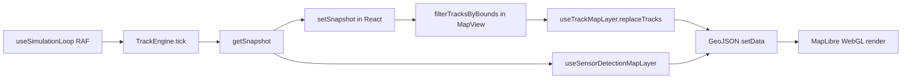

# Performance analysis

Analysis of simulator rendering and simulation cost, conducted June 2026. Goal: understand why the app can stress high-end hardware and identify a path to **60 fps on a basic laptop** with hundreds of visible tracks.

> **Validation:** A deep benchmark pass on 2026-06-25 confirmed most claims and identified one under-documented bottleneck — `syncActiveTrackKinematicsFromFlightWorld`. See [validation-results.md](validation-results.md) for measured numbers and confidence levels.

## Executive summary

The app is slow because of **compounding costs**, not because it draws thousands of DOM sprites. Aircraft are already rendered by **MapLibre WebGL symbol layers**. The main pain points are:

1. **`syncActiveTrackKinematicsFromFlightWorld` — O(tracks × fleet) haversine search (~15 ms/tick at 330 firm tracks / 1200 fleet)** — validated June 2026
2. **React re-renders on every simulation tick** (~10 Hz) — architectural
3. **Full GeoJSON `setData` rebuilds** across six sources, repeated on pan/zoom — architectural (JS prep &lt;2 ms; MapLibre GPU cost unmeasured in Node)
4. **O(n²) sensor correlation** during radar/IFF scans (+29 ms on IFF interval ticks) — validated
5. **Global fleet simulation** (up to 1500 aircraft advanced every tick) — validated (~1 ms advance at 1200 fleet)
6. **Globe projection + dense vector basemap** (93 layers) consuming GPU budget
7. **`icon-allow-overlap: true`** forcing MapLibre to draw every symbol without collision culling

Pure JavaScript render-prep (building GeoJSON, `map.project`) is relatively cheap on a fast CPU. **MapLibre's reaction to `setData()`** and **React reconciliation** dominate browser time alongside simulation sync cost.

---

## Architecture

### Tech stack (rendering)

| Layer | Technology |
|-------|------------|
| Framework | Next.js 16, React 19 |
| Map | MapLibre GL JS 5.x (internal WebGL) |
| Tracks | GeoJSON sources + symbol/line layers |
| Icons | Canvas 2D → `ImageBitmap` → `map.addImage` (image atlas) |
| Overlays | HTML/React for attention labels, bearing/range markers |

There is **no custom WebGL** for tracks today. Canvas is used only to rasterize MIL-STD-2525 / familiar silhouettes before upload to MapLibre.

### Data flow

**Key separation:** the engine holds **all firm tracks globally**. Viewport culling is **display-only** (`MapView.js` → `filterTracksByBounds`).

### Per-tick work (~10 Hz)

1. `TrackEngine.tick()` — flight world advance, extrapolation, sensor scans
2. `notifyListeners()` → `setSnapshot()` → **MapView subtree re-render**
3. `replaceTracks(visibleTracks)` — full track map replace
4. `scheduleSetData()` — 2× `setData` (symbols + heading vectors)
5. `useSensorDetectionMapLayer` — 4× `setData` (radar/IFF current/history)

### Per pan/zoom frame (up to 60 Hz while dragging)

1. `MapView` `move`/`zoom` → `replaceTracks` again
2. `useTrackMapLayer` → `scheduleSetData` (vectors use screen-space `project`/`unproject` per track)
3. `useSensorDetectionMapLayer` → 4× `setData` with reprojected tick geometry
4. `TrackAttentionOverlay` → `setState` + `map.project()` per flagged track

---

## How aircraft are drawn

1. Simulation produces track objects (lng/lat, heading, identity, type, …)
2. `MapView` filters to viewport-visible tracks → `trackMapLayer.replaceTracks`
3. `trackToFeature` builds GeoJSON Points with `properties.icon` = cached icon ID
4. `ensureTrackIcon` (async) rasterizes familiar silhouette or full milsymbol → `map.addImage`
5. MapLibre **symbol layer** `tracks-symbols` draws icons with zoom-based size and map-aligned rotation
6. Separate **symbol layer** for labels; **line layer** for heading/velocity vectors

Default: **familiar platform silhouettes** (identity-colored). Full MIL-STD-2525 when `infoFields` is enabled on a track.

---

## Profiling results

> Numbers combine initial investigation with the **2026-06-25 validation pass**. See [validation-results.md](validation-results.md) for methodology and confidence labels.

Benchmarks were run in Node (simulation) and via isolated JS microbenchmarks (render-prep). Browser GPU time is inferred from architecture. Cloud-agent CPU is not representative of user laptops.

### Steady-state simulation phases (wide viewport, 1200 fleet, ~330 firm tracks)

| Phase | Validated avg (ms) | Notes |
|-------|-------------------|-------|
| `flightWorld.advance` | 0.95 | O(fleet); viewport-independent |
| **`syncActiveTrackKinematicsFromFlightWorld`** | **15.47** | **Dominant** — O(tracks × fleet) |
| `trackStore.extrapolate` | 0.05 | O(tracks) |
| `enrichTracksWithAttentionFlags` | 0.08 | O(tracks) |
| `correlateDetections` (300×329) | 2.68 | Per radar scan |

### Full tick timing (same setup)

| Tick type | Validated avg (ms) | P95 (ms) |
|-----------|-------------------|----------|
| Normal | 16.8 | 17.5 |
| IFF scan interval | 46.1 | 63.4 |

### Viewport width effect (1200 fleet)

| Viewport | Firm tracks | Avg tick (ms) |
|----------|-------------|---------------|
| Narrow | 72 | 4.7 |
| Wide (CONUS) | 333 | 20.4 |

### Fleet scaling (initial + validated advance)

| Fleet size | Firm tracks (wide) | Avg tick | P95 tick |
|-----------|-------------------|----------|----------|
| 800 | ~219 | 8.6 ms | 17.3 ms |
| 1200 | ~332 | 19.4 ms | 40.9 ms |
| 1500 | ~361 | 26.5 ms | 54.9 ms |

Post-validation: most tick cost is **syncKinematics**, not fleet advance (~1 ms at 1200).

### Correlation complexity (O(detections × tracks)) — validated

| N (detections ≈ tracks) | Correlate time |
|------------------------|----------------|
| 100 | 0.42 ms |
| 400 | 3.96 ms |
| 800 | 15.90 ms |
| 1000 | 24.64 ms |

### Render-prep CPU (JavaScript only, before MapLibre) — validated

| Visible tracks | Vectors | 4× sensor rebuild | JSON stringify |
|---------------|---------|---------------------|----------------|
| 300 | 0.17 ms | 0.21 ms | 0.18 ms |
| 1000 | 0.15 ms | 0.34 ms | 0.84 ms |

Building GeoJSON in JS is not the bottleneck. **MapLibre reprocessing after `setData`** is (browser-side).

### Basemap cost

- Carto Voyager style: **93 vector layers**, globe projection enabled in `useMapLibreMap.js`
- Remote vector tiles and sprites from Carto CDN

---

## Ranked bottlenecks

> **Updated after 2026-06-25 validation.** See [validation-results.md](validation-results.md).

| Rank | Subsystem | Why it hurts | Confidence |
|------|-----------|--------------|------------|
| **1** | **`syncActiveTrackKinematicsFromFlightWorld`** | ~15 ms/tick at 330 tracks — each track scans all aircraft | Measured |
| **2** | React ↔ Map coupling | Every tick → `setSnapshot` → MapView re-render | Architectural |
| **3** | Full GeoJSON `setData` churn | Six sources; JS &lt;2 ms but MapLibre reprocesses all geometry | Architectural |
| **4** | IFF/radar scan spikes | IFF tick 2.7× normal (+29 ms) | Measured |
| **5** | O(n²) correlation | 2.7 ms at 300×329; 25 ms at 1000×1000 | Measured |
| **6** | Pan/zoom cascade | Four handlers, 6× `setData`, multiple `setState` | Static |
| **7** | Global fleet advance | ~1 ms at 1200 aircraft every tick | Measured |
| **8** | Symbol layer config | `icon-allow-overlap: true` disables culling | Static |
| **9** | Globe + dense basemap | 93 vector layers | Static |
| **10** | Screen-space vectors | Per-track reprojection on pan; JS cost still low | Measured (JS) |
| **11** | Icon cold-start | Async canvas + `addImage` | Static |
| **12** | Dead optimization hook | `shouldCoalesceUpdates()` never called | Static |

### Existing mitigations

- Viewport display culling (simulation remains global)
- RAF batching for some `setData` calls
- Icon ID caching and familiar-icon fast path
- Adaptive tick rate (`PerfBudgetController`) — reduces Hz under load, not render work
- Quality presets capping fleet (400–1500)

---

## Evaluating common ideas

### “Use WebGL instead”

**Already in use** for track drawing via MapLibre symbol layers. The weakness is the **data path**: rebuilding GeoJSON and calling `setData()` 10–60 times per second.

**Custom MapLibre layer** or **deck.gl** overlay (IconLayer + LineLayer) with instanced draws is a viable upgrade while keeping MapLibre for the basemap.

### “Draw all sprites to one image”

**Partially done today:** each icon variant gets its own `map.addImage` entry; familiar icons cache by domain/identity/type.

**Full sprite atlas:** pre-bake ~48 familiar silhouettes into one PNG, single atlas upload, UV lookup in a custom layer — eliminates async per-icon generation and atlas fragmentation. Tradeoff: less per-track customization unless MIL-STD remains a optional high-fidelity mode.

---

## Key source files

| Area | Files |
|------|-------|
| Simulation tick | `app/simulation/TrackEngine.js`, `app/hooks/simulation/useSimulationLoop.js` |
| **Sync kinematics (top sim cost)** | `app/simulation/syncActiveTrackKinematicsFromFlightWorld.js`, `FlightWorldSimulator.findNearestAircraft` |
| Adaptive perf | `app/simulation/PerfBudgetController.js` |
| Track rendering | `app/hooks/map/useTrackMapLayer.js` |
| Sensor rendering | `app/hooks/map/useSensorDetectionMapLayer.js` |
| Viewport cull | `app/components/map/MapView.js`, `app/tools/map/mapViewportUtils.js` |
| Vectors (screen-space) | `app/simulation/trackVectorFeatures.js` |
| Correlation | `app/simulation/correlation.js`, `app/simulation/CorrelationService.js` |
| Icons | `app/tools/milstd2525/createMilStd2525Icon.js` |
| Map init | `app/hooks/map/useMapLibreMap.js` |

---

## Browser profiling checklist

On hardware that lags:

1. **Chrome Performance** — record 10 s while panning dense traffic; look for `setData`, React reconciliation, GPU rasterization
2. **Dev console** — `window.__airspaceSimStressHarness({ trackTarget: 1200, ticks: 120 })` (development builds)
3. **Live overlay** — see [instrumentation.md](instrumentation.md)
4. Temporarily log `performance.now()` around each `setData` to identify the slowest source
