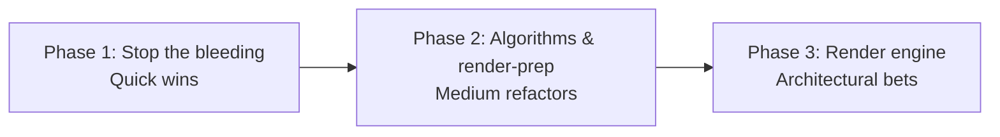

# Performance optimization plan

Phased roadmap from the June 2026 performance investigation, **updated after validation (2026-06-25)**. See [analysis.md](analysis.md) and [validation-results.md](validation-results.md).

**Target:** maintain **60 fps on a basic laptop** with a realistic number of visible tracks (hundreds, not necessarily full global_dense at continental zoom).

**Validated top simulation cost:** `syncActiveTrackKinematicsFromFlightWorld` (~15 ms/tick at 330 firm tracks). **Validated top architectural cost:** React + MapLibre `setData` coupling (browser-side).

---

## Shipped commits

| Milestone | Reference |
|-----------|-----------|
| Live performance analytics overlay | Shipped — Settings → Advanced |
| Phase 1–3 optimization work | Planned — see status in [performance/README.md](README.md) |

When a phase ships, add a row here with the commit SHA or PR link before updating phase checklists.

---

## Recommended sequence



| Phase | Focus | Risk | Impact |
|-------|--------|------|--------|
| **1** | **syncKinematics spatial index**, React decoupling, fewer full rebuilds, coalesced updates, Mercator toggle | Low–Medium | **Highest** — addresses measured 15 ms/tick + architectural render cost |
| **2** | Spatial correlation, sprite atlas, fix vector reprojection | Medium | High — removes IFF scan spikes; icon cold-start |
| **3** | deck.gl / canvas atlas / custom WebGL for all dynamic geometry | Higher | Transformative — 500+ moving symbols at 60 fps |

---

## Phase 1 — Quick wins

Low-to-medium risk. Implement first. Validation showed simulation can be fixed **before** any render-engine rewrite.

### 1.0 Spatial index for `findNearestAircraft` (**new — highest validated sim win**)

- **Problem:** `syncActiveTrackKinematicsFromFlightWorld` calls `findNearestAircraft` per firm track; each call scans all aircraft — **~15 ms at 330 tracks / 1200 fleet**
- **Fix:** Maintain a spatial grid or R-tree on aircraft positions; query nearest in O(1)–O(log n) per track
- **Expected:** syncKinematics **15 ms → ~1 ms**; normal tick **17 ms → ~3 ms** (simulation only)
- **Files:** `FlightWorldSimulator.js`, `syncActiveTrackKinematicsFromFlightWorld.js`

### 1.1 Decouple simulation from React renders

- Keep engine snapshot in a **ref**; update map layers **imperatively** from the RAF loop
- Only `setState` for UI that truly needs it (track management windows, alarms)
- **Files:** `useSimulationLoop.js`, `MapView.js`, layer hooks

### 1.2 Stop full `replaceTracks` on every snapshot

- `replaceTracks` clears `tracksRef` and rebuilds; on tick only positions change
- Use `upsertTracks` for stable viewport membership; reserve `replaceTracks` for cull membership changes (pan/zoom boundary crossings)

### 1.3 Coalesce pan/zoom `setData`

- Wire up **`PerfBudgetController.shouldCoalesceUpdates()`** (currently dead code)
- Single RAF handler for tracks + sensors + vectors instead of three independent `move`/`zoom` listeners
- Skip vector reprojection below a small movement threshold

### 1.4 Mercator projection toggle

- Globe adds GPU cost; offer `projection: 'mercator'` in settings for lower-end GPUs
- **File:** `useMapLibreMap.js`

### 1.5 Level-of-detail defaults

- Hide heading vectors below zoom 7
- Hide track text labels below zoom 8
- Reduce sensor history layer updates when `loadFactor < 0.7`

### 1.6 Laptop-friendly defaults

- Ensure new sessions default to `balanced` preset (800 aircraft cap)
- Consider lowering default `maxActiveFlights` if metrics justify it

---

## Phase 2 — Medium refactors

### 2.1 Incremental GeoJSON updates

- `promoteId` on sources + `setFeatureState` for stale/selected/opacity
- Call full `setData` only when tracks enter/leave viewport or change identity/type
- For position-only updates: custom layer with typed array, or worker-side feature array reuse

### 2.2 Spatial index for correlation

- Replace O(n²) `correlateDetections` and IFF correlation with uniform grid or R-tree in NM space
- Validated: 1000×1000 ≈ 25 ms → expect ~1–2 ms with grid
- **Lower urgency than 1.0** at current densities (2.7 ms steady vs 15 ms syncKinematics), but critical for IFF scan spikes
- **Files:** `correlation.js`, `iffCorrelation.js`, `CorrelationService.js`

### 2.3 Web Worker for simulation

- `TrackEngine.tick` off main thread; main thread receives compact position buffer
- Frees main thread for MapLibre and input

### 2.4 Pre-baked sprite atlas

- One startup image with all familiar icons (identity × type matrix)
- Remove async `addMilStd2525IconToMap` from hot path
- **Files:** `createMilStd2525Icon.js`, `useTrackMapLayer.js`

### 2.5 Screen-space vectors

Choose one:

| Option | Approach |
|--------|----------|
| A | Custom WebGL line layer — heading/speed as attributes, endpoints in vertex shader |
| B | Drop vectors at low zoom; simple `icon-offset` tick at high zoom only |
| C | deck.gl `LineLayer` with pixel width (native screen-space) |

**Files:** `trackVectorFeatures.js`, `useTrackMapLayer.js`

---

## Phase 3 — Architectural bets

For **60 fps with 500+ visible tracks** on modest hardware.

### 3.1 deck.gl overlay (recommended balance)

```
MapLibre (basemap only, Mercator, simplified style)
  └── deck.gl IconLayer (all tracks, instanced)
  └── deck.gl LineLayer (vectors + sensor ticks)
```

- Industry-standard pattern for high-density geo viz
- ~1000 icons ≈ one draw call
- MapLibre retains tiles, pan/zoom, projection

### 3.2 Full custom MapLibre CustomLayer

- Raw WebGL / regl / luma.gl
- Single VBO for positions, one atlas texture, shader for rotation/tint
- Maximum control, higher maintenance

### 3.3 Canvas 2D overlay

- One `<canvas>` over the map; `map.project` → `drawImage` from atlas per track
- ~1000 sprites often 1–3 ms on modern hardware
- Simpler than WebGL; weaker globe tilt/pitch integration
- Pairs naturally with **sprite atlas** (Phase 2.4)

### 3.4 Client-side clustering / LOD

- Zoom &lt; 8: cluster circles with counts
- Zoom 8–10: dots
- Zoom &gt; 10: full symbology
- Matches operational C2 conventions

### 3.5 Simpler basemap

- Replace 93-layer Voyager with 10–15 layer “performance” style, or raster at low zoom
- Frees GPU for dynamic content

---

## Option comparison matrix

| Approach | Effort | 60 fps @ 500 tracks | MapLibre compatibility | Notes |
|----------|--------|---------------------|--------------------------|-------|
| **syncKinematics spatial index** | Low–Medium | Helps sim CPU | Full | **Validated #1 sim win** |
| Phase 1 (React + setData) | Low | Maybe | Full | Essential for browser path |
| Incremental GeoJSON | Medium | Unlikely alone | Full | Reduces setData churn |
| Spatial correlation | Medium | Helps scan spikes | Full | Lower steady-state priority than 1.0 |
| Sprite atlas | Medium | Helps | Full | Icon cold-start only |
| deck.gl overlay | Medium–High | Strong | Excellent | Best render-engine bet |
| Canvas + atlas | Medium | Good | Good | Simpler than raw WebGL |
| Custom WebGL layer | High | Strong | Good | Most control |
| Mercator + thin basemap | Low | Helps GPU | Full | Complements all paths |

---

## What not to do first

- Rewriting the entire app outside MapLibre before Phase 1
- Adding a charting library only for perf overlay (canvas is enough)
- Reducing fleet to viewport-only **simulation** without an explicit product decision (changes training fidelity)

---

## Success criteria

| Metric | Target |
|--------|--------|
| Frame time (p95) | &lt; 16.7 ms while panning at `balanced` preset |
| Simulation tick (p95) | &lt; 10 ms with wide viewport, 800 aircraft | Validated baseline: 17 ms normal, 46 ms IFF |
| Visible tracks | 300+ at 60 fps after Phase 3 |
| Visual fidelity | No regression to familiar icons, labels, vectors at operational zoom |

---

## Tracking

Update [README.md](README.md) in this folder when phases complete. Link PRs and commits in the status table.

| Phase | Status |
|-------|--------|
| Investigation | ✅ Documented |
| Deep validation (2026-06-25) | ✅ [validation-results.md](validation-results.md) |
| Live instrumentation overlay | ✅ See [instrumentation.md](instrumentation.md) |
| Phase 1 (syncKinematics index + React decoupling) | ⬜ Planned — **start here** |
| Phase 2 | ⬜ Planned |
| Phase 3 | ⬜ Exploratory |
